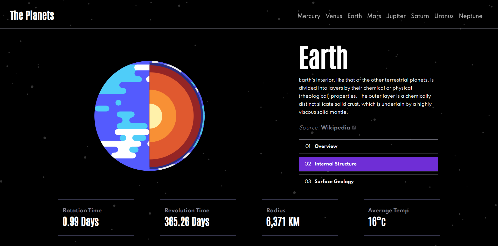

# Frontend Mentor - Planets fact site solution

This is a solution to the [Planets fact site challenge on Frontend Mentor](https://www.frontendmentor.io/challenges/planets-fact-site-gazqN8w_f).

## Table of contents

- [Overview](#overview)
  - [The challenge](#the-challenge)
  - [Screenshot](#screenshot)
  - [Links](#links)
- [My process](#my-process)
  - [Built with](#built-with)
  - [What I learned](#what-i-learned)
- [Author](#author)

## Overview

### The challenge

Users should be able to:

- View the optimal layout for the app depending on their device's screen size
- See hover states for all interactive elements on the page
- View each planet page and toggle between "Overview", "Internal Structure", and "Surface Geology"

### Screenshot

### Links

- [GitHub URL](https://github.com/DanB-Web/FEM_Planet_Facts)
- [Live Site URL](https://dba-fem-planets.netlify.app/planets/Earth)

## My process

### Built with

- [React](https://reactjs.org/) - JS library
- [Next.js](https://nextjs.org/) - React framework
- [Sass](https://sass-lang.com/) - For styles
- [Figma](https://www.figma.com/)
- [Netlify](https://www.netlify.com/)

### What I learned

I wanted to create a full Next applicaiton from scratch, using the integrated Next router. I created a seperate `planets` folder to hold the various views, and the URL slugs are generated at build time using `getStaticPaths` and `getStaticProps`static page generation - at build time, all the data is read from a supplied JSON file and the various views populated.

The site is also fully responsive, from desktop to mobile. The media queries became quite complex, with a lot of content rearrangement, and there are different menus depending on the window size.

I also used Sass inside the CSS modules, as I wanted to experiment and see how easy it would be to integrate.

As in other Frontend Mentor challenges, I really enjoyed working from supllied Figma files - I like the challenge of making the site look as close to the brief as possible, and the challenge of implementing someone elses idea.

## Author

- Website - [Dan Bayford](https://dba-portfolio.netlify.app/)
- Frontend Mentor - [@DanB-Web](https://www.frontendmentor.io/profile/DanB-Web)
